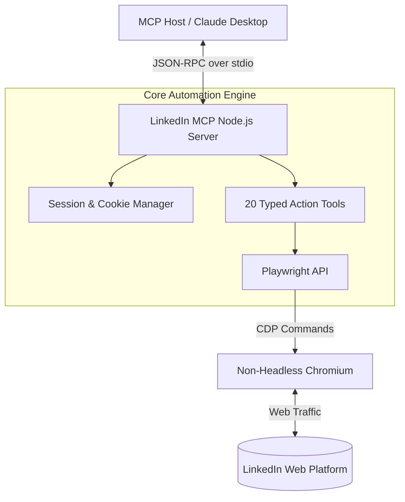

<div align="center">
  
  
  # LinkedIn MCP Server
  
  **Programmable LinkedIn Automation via Playwright and the Model Context Protocol.**

  [](https://www.typescriptlang.org/)
  [](https://nodejs.org/)
  [](https://playwright.dev/)
  [](https://modelcontextprotocol.io/)
</div>

## 📌 Overview

This MCP server exposes LinkedIn as a programmable platform via Playwright browser automation. It provides 20 strictly typed tools across profile management, connections, messaging, feed interaction, and job searching. All interactions are driven by automating a real Chromium browser against LinkedIn's web UI, entirely bypassing unofficial APIs.

## 🏗️ Architecture



## 🚀 Getting Started

### Prerequisites
- Node.js 20+
- A LinkedIn Account
- Environment configuration

### Setup
```bash
# Install dependencies
npm install

# Build the project
npm run build

# Configure environment
cp .env.example .env
```

Edit your `.env` to include dummy/example credentials or your real credentials if deploying locally:
```env
LINKEDIN_EMAIL=example@example.com
LINKEDIN_PASSWORD=your_password
COOKIES_PATH=./linkedin_cookies.json
```

*(Note: Session cookies are persisted automatically after the first successful login).*

## 🛠️ Tool Ecosystem

### 👤 Profile Tools
- `get_my_profile` / `get_my_profile_full`
- `get_person_profile` / `get_person_profile_full`

### ✏️ Profile Editing (ProseMirror compatible)
- `update_profile_text` / `edit_headline`
- `add_experience_block` / `add_skill`

### 🤝 Networking Pipeline
- `search_people` / `connect_with_person`
- `smart_connect`: Autonomous multi-phase networking pipeline (Scrape -> Search -> Score -> Reach Out).

### 💬 Messaging & Feed
- `get_inbox` / `send_message`
- `get_feed` / `get_company_posts` / `create_post`

### 💼 Job Search
- `search_jobs` / `get_job_details`

## ⚙️ Technical Highlights

- **Anti-Bot Circumvention**: Utilizes non-headless Chromium instances to mimic legitimate user interaction.
- **ProseMirror Handlers**: Gracefully handles LinkedIn's complex TipTap/ProseMirror rich-text editors for post creation and profile updates.
- **Dry-Run Safety**: All mutating endpoints support a `dryRun` boolean, executing form logic while bypassing the final submit action.
- **Session Resilience**: Implements automated login detection and session recovery loops with explicit CAPTCHA abortion.
